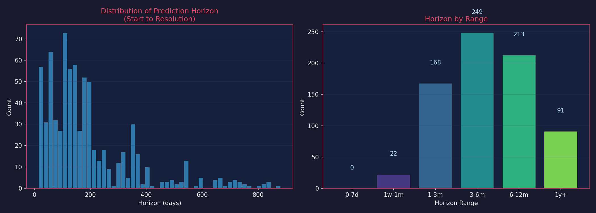

# ForecastBench v1 - Resolved Questions Dataset

## Overview

This dataset contains **8,575 resolved** forecasting questions from ForecastBench, split into training-ready X (questions) and y (resolutions) files.

---

## Dataset Statistics

| Metric | Value |
|--------|-------|
| **Total Resolved** | 8,575 |
| Single Questions | 4,650 |
| Composed Questions | 3,925 |

| Temporal Range | |
|----------------|---|
| Forecast Dates | 2024-07-21 to 2025-12-07 |
| Resolution Dates | 2024-07-25 to 2025-12-23 |
| Horizon (Start→Resolution) | 15d - 881d (mean: 195d, median: 145d) |

---

## Visualizations

### Questions by Source


### Class Distribution (Resolution Values)


| Dataset | Yes (1.0) | No (0.0) |
|---------|-----------|----------|
| Single | 1,577 (33.9%) | 3,073 (66.1%) |
| Composed | 1,716 (43.7%) | 2,209 (56.3%) |

### Class Distribution by Source


### Temporal Distribution


### Prediction Horizon Distribution



| Horizon Range | Count |
|---------------|-------|
| 0-7 days | Short-term |
| 1 week - 1 month | Near-term |
| 1-3 months | Medium-term |
| 3-6 months | Long-term |
| 6-12 months | Very long-term |
| 1+ year | Extended |

### Horizon by Source


---

## Files

| File | Description | Size |
|------|-------------|------|
| `X_single_resolved.json` | Single question data | 10.4 MB |
| `y_single_resolved.json` | Single resolutions | 909 KB |
| `X_compose_resolved.json` | Composed question pairs | 15.0 MB |
| `y_compose_resolved.json` | Composed resolutions | 1.0 MB |

---

## Schema

### X_single_resolved.json
```json
{
  "metadata": { "created_at": "...", "version": "1.0", "total_single": 4650 },
  "questions": [{
    "id": "string",
    "question_set": "2024-07-21-llm.json",
    "forecast_due_date": "2024-07-21",
    "source": "manifold|metaculus|polymarket|acled|fred|wikipedia|yfinance|dbnomics|infer",
    "question": "Will X happen?",
    "resolution_criteria": "...",
    "background": "...",
    "url": "https://...",
    "freeze_datetime": "2024-07-12T00:00:00+00:00",
    "freeze_datetime_value": "0.937"
  }]
}
```

### y_single_resolved.json
```json
{
  "resolutions": [{
    "id": "string",
    "resolved_to": 0.0 | 1.0,
    "resolution_date": "2024-07-28",
    "direction": null
  }]
}
```

### X_compose_resolved.json
```json
{
  "questions": [{
    "id": "id1_id2",
    "question": "We are presenting you with two probability questions...",
    "sub_question_1": "Will X happen?",
    "sub_question_2": "Will Y happen?",
    "sub_id_1": "...",
    "sub_id_2": "..."
  }]
}
```

### y_compose_resolved.json
```json
{
  "resolutions": [{
    "id": "id1_id2",
    "resolved_to": 0.0 | 1.0,
    "direction": [1, 1] | [1, -1] | [-1, 1] | [-1, -1]
  }]
}
```

---

## Usage

```python
import json

# Load single questions
with open('X_single_resolved.json') as f:
    X_single = json.load(f)['questions']
with open('y_single_resolved.json') as f:
    y_single = json.load(f)['resolutions']

# Iterate
for x, y in zip(X_single, y_single):
    assert x['id'] == y['id']
    question = x['question']
    answer = y['resolved_to']  # 0.0 or 1.0
```

---

## Sources

| Source | Type | Description |
|--------|------|-------------|
| manifold | Prediction Market | User-submitted prediction markets |
| metaculus | Prediction Platform | Forecasting questions |
| polymarket | Prediction Market | Crypto-based markets |
| acled | Data | Conflict data |
| fred | Data | Economic indicators |
| wikipedia | Data | Factual data |
| yfinance | Data | Financial data |
| dbnomics | Data | Economic statistics |
| infer | Prediction Platform | Forecasting platform |

---

**Created**: 2026-01-01 | **Source**: ForecastBench (2024-07-21 to 2025-12-07)
