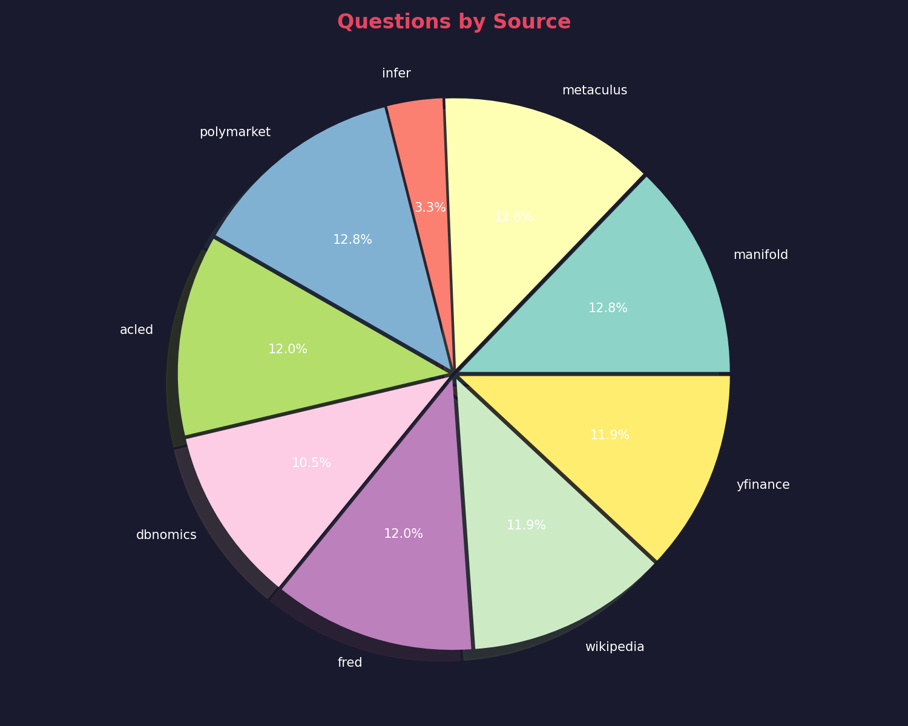
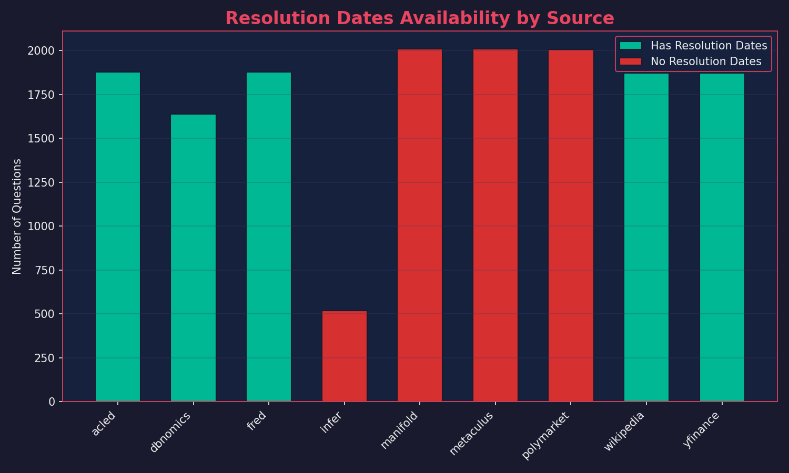

# ForecastBench Dataset Analysis Report

## Overview

This report provides a comprehensive analysis of the ForecastBench question sets for forecasting benchmarks.

---

## Summary Statistics

| Metric | Value |
|--------|-------|
| **Total Question Sets** | 19 |
| **Total Questions** | 15,684 |
| **Sources** | 9 |
| **Combined Questions** | 6,468 (41.2%) |
| **Missing Resolution Dates** | 6,544 (41.7%) |

---

## Questions by Source



| Source | Count | Percentage |
|--------|-------|------------|
| manifold | 2,011 | 12.8% |
| metaculus | 2,009 | 12.8% |
| polymarket | 2,006 | 12.8% |
| acled | 1,877 | 12.0% |
| fred | 1,877 | 12.0% |
| wikipedia | 1,873 | 11.9% |
| yfinance | 1,873 | 11.9% |
| dbnomics | 1,640 | 10.5% |
| infer | 518 | 3.3% |

---

## Questions per File


Most LLM sets contain ~1,000 questions. Recent sets (Oct-Dec 2025) contain 500 questions each.

---

## Question Types: combination_of Analysis


### What is `combination_of`?

| Type | Count | Description |
|------|-------|-------------|
| **N/A** | 9,216 (58.8%) | Single standalone questions |
| **List of 2** | 6,468 (41.2%) | Combined probability questions |

> **Important:** Questions with `combination_of` set to a list contain **2 related sub-questions** bundled together. These ask forecasters to predict joint/combined probabilities.

**Example Combined Question:**
```
Main: "We are presenting you with two probability questions. 
       Please predict the probability..."

Sub-questions:
1. "Will the majority of new cars sold be electric by 2030?"
2. "Will any Paris 2024 Olympic event be cancelled due to Seine water quality?"
```

---

## Resolution Dates Analysis



### Resolution Dates by Source

| Source | Without Dates | Total | % Missing |
|--------|--------------|-------|-----------|
| **manifold** | 2,011 | 2,011 | 100% ❌ |
| **metaculus** | 2,009 | 2,009 | 100% ❌ |
| **polymarket** | 2,006 | 2,006 | 100% ❌ |
| **infer** | 518 | 518 | 100% ❌ |
| acled | 0 | 1,877 | 0% ✓ |
| fred | 0 | 1,877 | 0% ✓ |
| wikipedia | 0 | 1,873 | 0% ✓ |
| yfinance | 0 | 1,873 | 0% ✓ |
| dbnomics | 0 | 1,640 | 0% ✓ |

> **Note:** Prediction market sources (manifold, metaculus, polymarket, infer) have 100% missing resolution dates - they resolve based on real-world events. Data sources (acled, fred, etc.) have 100% resolution dates - defined reporting dates.

---

## Key Insights

1. **Balanced Sources**: 9 sources with fairly even distribution (10-13% each, except infer at 3.3%)

2. **Two Question Types**:
   - ~59% are single standalone questions
   - ~41% are combined 2-question pairs for joint probability forecasting

3. **Resolution Date Pattern**:
   - Prediction markets (manifold, metaculus, polymarket) → No fixed resolution dates
   - Data sources (fred, yfinance, etc.) → Have specific resolution dates

4. **Data Volume**: ~1,000 questions per biweekly set (reduced to 500 for recent sets)
